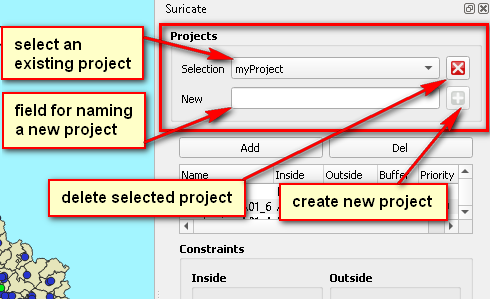
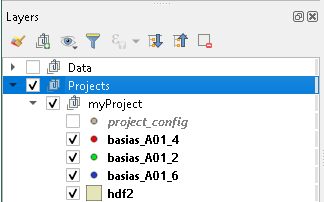
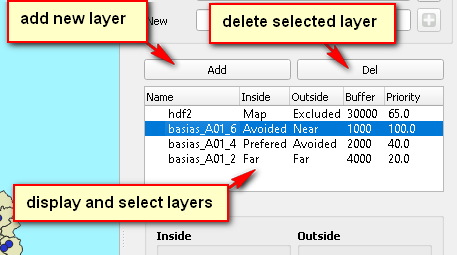
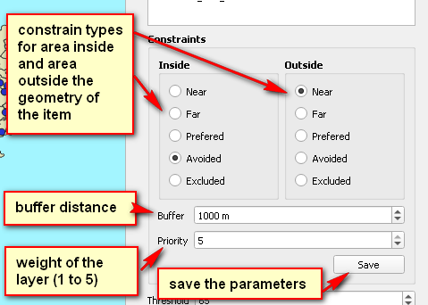
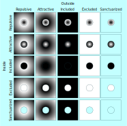
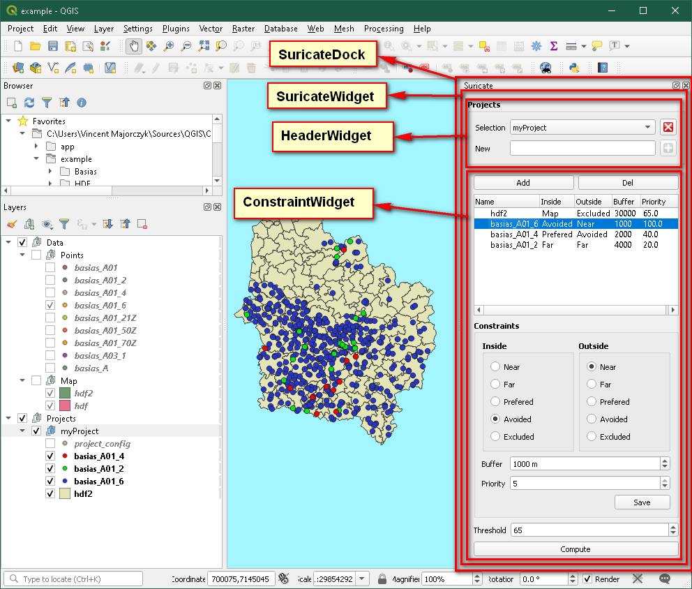

# Suricates plugin for QGIS

## 1) Application

This application is a plugins for the software [QGIS](https://qgis.org/): it is compatible with the version *3.10.9* (Long Term Release)

This application is based on the theorical model and treatment design of [*Eric Masson*](https://pro.univ-lille.fr/eric-masson/) Professor (Associate) of the *Université de Lille*.

This application was ordered by the *Université de Lille* (France), *UFR de Géographie et Aménagement* and funded by ERDF Interreg NWE (SURICATES Project 2017-2023).

This application was initially developed by [Vincent Majorczyk](https://www.linkedin.com/in/vincentmajorczyk/?lipi=urn%3Ali%3Apage%3Ad_flagship3_feed%3BcBKV%2FjGxRH%2BBwA8k716Xjw%3D%3D) ([*CDI-Technologies*](https://www.linkedin.com/company/cdi-technologies)  2020).

This application is released under the open source license [GNU-General Public License 3](gpl-3.0.md).

website: https://cditech.fr/raies/

repository: https://github.com/CDI-Tech/QGIS-RAIES

bug tracking: https://github.com/CDI-Tech/QGIS-RAIES/issues

## 2) Publications

> **Jan 2021**: [Un outil participatif (RAIES) pour la localisation de sites de valorisation de dragage : application à l'estuaire de la Rance.](https://www.researchgate.net/publication/355393946_Un_outil_participatif_RAIES_pour_la_localisation_de_sites_de_valorisation_de_dragage_application_a_l'estuaire_de_la_Rance)
>
> Eric Masson, Edwige Motte, Guillaume G Chevalier, Jean-Batiste Litot, Christelle Audouit, Philippe Deboudt, Blanpain Olivier
>
> **Presentation:** *Cette communication à destination des élus présente le potentiel d'une application SIG développée sous QGIS dans le cadre du projet Suricates (2017-2023) financé par Interreg ENO. Les premiers résultats cartographiques suites aux entretiens réalisés auprès d'acteurs de la Rance illustrent le potentiel de cette application participative.*

> **Nov 2020:** [RAIE : un outil de cartographie de l'acceptabilité territoriale au réemploi de sédiments d'infrastructure portuaire.](https://www.researchgate.net/publication/346811227_RAIE_un_outil_de_cartographie_de_l'acceptabilite_territoriale_au_reemploi_de_sediments_d'infrastructure_portuaire) 
>
> Eric Masson, Edwige Motte, Guillaume G Chevalier, Jean-Batiste Litot, Christelle Audouit, Philippe Deboudt, Blanpain Olivier
>
> **Conference Paper meriGéo**: *La gestion des zones côtières implique un échange entre des acteurs territoriaux qui doivent converger vers une prise de décision lorsqu’il s’agit de construire, aménager, protéger une infrastructure ou un espace « naturel »*

> **Oct 2019:** [RAIE : Modélisation des représentations spatiales pour la production de cartes mentales sur base d'ontologie déclarative.](https://www.researchgate.net/publication/337316228_RAIE_Modelisation_des_representations_spatiales_pour_la_production_de_cartes_mentales_sur_base_d'ontologie_declarative)
>
> Eric Masson, Jean-Baptiste Litot, Blanpain Olivier
>
> **Poster**

> **Fev 2019:** [RAIE : Un modèle d’analyse numérique du géopotentiel des territoires basé sur les représentations des contraintes spatiales.](https://www.researchgate.net/publication/330988188_RAIE_Un_modele_d'analyse_numerique_du_geopotentiel_des_territoires_base_sur_les_representations_des_contraintes_spatiales)
>
> Eric Masson, Sarah Cabarry, Jean-Baptiste Litot, Blanpain Olivier
>
> **Presentation 14ème rencontres de Théo Quant:** GIS application developed within the SURICATES project.

## 3) User manual

### 3.I) install the plugin

The first step consists to compress the folder which contains script in a *ZIP* file. Next, go to *Menu/Plugins/Manage and install plugins/install from ZIP* and load the *ZIP* file. A new submenu appears in the *Menu/Plugin* named 'RAIES' which contains an action named 'RAIES'. This last load a new panel at the right of the main windows of *QGis*.

### 3.2) prepare data

The application must be executed in the context of a *QGIS* project which contains prepared database: data must have a common CRS (Coordinate Reference System) and the application accepts only vector layers as input. Inputs will be used to produce a raster layer of cumulated constraints.

### 3.3) manage 'RAIES' projects

When the application is started, a group 'Projects' is created at the root in the panel of layers. This will contains all projects using database available in the current *QGIS* project.

A *RAIES* project is a list of constraint choices which are used to create a raster. The raster indicates best locations depending the list of constraints.

The panel *RAIES* is divided in tree parts: the management of projects and the management of the constraint list of the current project and parameter of the current constraint.

The control to manage projects is composed of four items:

- a combobox with the available projects: this allows to select the project to configure;
- a button to delete the selected project;
- a field to type the name of a new project;
- a button to create a new project: this button is disactivated if the name already exists.

Each project is visualized as a subgroup of the group 'Projects'   on the panel of layers. The subgroup contains a layer named *project_config* which contains information about constraints. The content of the layer *project_config* is displayed on the list in the *RAIES* panel.

### 3.4) configure a project

The second part of the panel *RAIES* allows to add, remove and select constraints.

The first layer to add is the shape of the region: the global area where computation will be executed. This is considered in the list as the constraint type *Map* and allows the configuration of a buffer around the zone.

A layer is added by selection in the panel of layers, then by clicking on the button 'Add'. If no features of the layer is selected, then the layer is integrally copied on the group of the project. If features of the layer are selected (zone selection,  attribute filter selection, ...), only selected features are copied.

The next added layers are configured by constraint choices:

- around the geometry of items of the input vector layer, a buffer area may be configured;
- inside the geometry of the items (and associated buffer areas), a constraint type is configured;
- outside the geometry of the items, another constraint type is configured;
- the output raster results from choice applied to a layer, and it has a weight compared to other output raster.

The button *Save* allow to save the parameters of the current constraint.

There are five constraint types:

- *Repulsive* and *Attractive* constraints: the bounds of the geometries are considered as near and the maximal distance from these as far:
  - If the constraint is *Attractive* the value near cells are 0 (black) and the far cells are 1 (white)
  - If the constraint is *Repulsive* the value near cells are 1 and the far cells are 0
- *Included* and *Excluded*: the value of the considered area is respectively 0 and 1
- *Sanctuarized*: the cells of the considered area are exclude of the final raster (No-Data value) 

### 3.5) compute raster from the project

Before to compute, save the *QGIS* project is recommended to avoid losses if the application crash.

To finalize the project: select a threshold value and click on the button *Compute*. The progress of the process appear on the status bar of *QGIS*.

For each layer (and its constraints), the *RAIES* application creates a raster weighted by the priority value. Next, all of these weighted rasters are cumulated and normalized from 0 to 1. Finally, the cumulated raster is binarized depending the threshold value: cells whom value exceed the threshold are set to 1 and the other cells are set to 0.

The weighted rasters, the cumulated raster and the binarized raster are put on the project subgroup. At the end of the computation a message box appear to ask if the application must delete other temporary rasters created in the folder *tmp/*.

### 3.6) note about panel of layer

Manipulation of the panel of layers is not considered as the correct way to add, delete or modify a project and may cause unexpected behavior, nevertheless there are many protections:

- create a subgroup in the group *Projects* will be considered as the creation of a new project (a layer *project_name* is created when the project is selected).
- renaming a project with the same name of another is impossible.
- no founded layers in a project will be indicated in the list of constraints.

## 4) Development

### 4.1) general

There are seven classes in this project:

- SuricateInstance which manages data of the instance;
- SuricateAlgo which is used as computing task and contains algorithms required by the project;
- Debug which facilitate debugging in the context of programming in the QGIS interface;
- user interfaces classes:
  - HeaderWidget which manages projects (creation, removing and selection);
  - ConstraintWidget which manages constraints of the selected project;
  - SuricateWidget which contains an HeaderWidget and a ConstraintWidget;
  - SuricateDock which contains SuricateWidget  and may be docked on the interface as panel;

There are two structures in this project:

- ConstraintItem which contains information relative to a constraint of a project. Each project groups constraints in a list;
- ConstraintType enumerate the possible constraints categories;

The function mainProgram is called at when the project is started: it close the previous instance of application if it exists and create a new instance. 

### 4.2) user interface

The user interface classes are imbricate as following:

- SuricateDock contains SuricateWidget;
- SuricateWidget contains HeaderWidget and ConstraintWidget;

The classes SuricateWidget and SuricateDock are widgets containers and are not interesting.

HeaderWidget aims to manage the projects and ConstrainsWidget manages the constraints of the selected project.

### 4.3) the other classes

SuricateInstance manages three aspects:

- the starting of the application,
- the access to files  and layers (creation, modification, ...)
- the layer treeviewer (add group, add layer, ...) 

SuricateAlgo is a task which computes a raster depending constraints. The input of this class is a list of ConstraintItem whom the attribute 'name' contains the absolute path of the layer. The classes manages layers created during the computation so also files and treewiewer. 

### 4.4) Generate documentation

The application code uses the documentation syntax by *Doxygen*. Generate the *html* documentation requires next steps:
- install [Doxygen](https://www.doxygen.nl/download.html);
- execute the *Doxywizard* application;
- load the *Doxygen* project: *doc/Doxyfile*;
- on the tab *Run*, click on the button *Run doxygen*;
- to show documentation on a web browser either click on the button *Show HTML output*, or execute the file *doc/html/index.html*.

> Copyright of this file (readme.md) :
> Author: Vincent Majorczyk *CDI-Technologies* (2020).
> License: Permission is granted to copy, distribute and/or modify this document
> under the terms of the [GNU Free Documentation License 1.3](fdl-1.3.md),
> or any later version published by the Free Software Foundation;
> with no Invariant Sections, no Front-Cover Texts, and no Back-Cover Texts.

The html version of the documentation is located at *doc/html/index.html* of the repository (Cf section 4.4).
