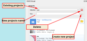
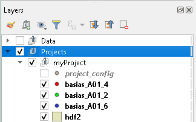
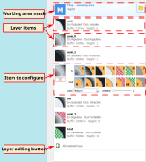
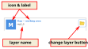
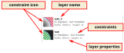
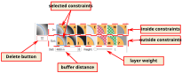
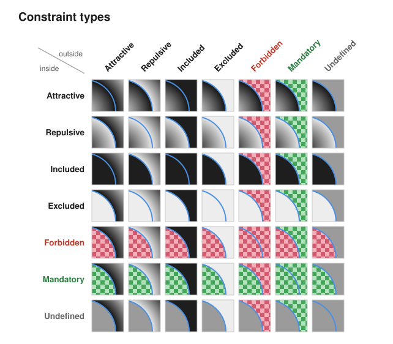
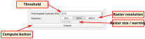
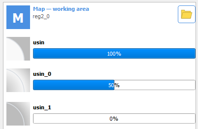
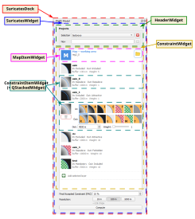

# Suricates plugin for QGIS

## 1) Application

This application is a plugin for the software [QGIS](https://qgis.org/). It is validated for QGIS *3.44.13* and requires QGIS *3.40* or later (see §5.5).

This application is based on the theoretical model and treatment design of [*Eric Masson*](https://pro.univ-lille.fr/eric-masson/), Associate Professor at the *Université de Lille*.

This application was commissioned by the *Université de Lille* (France), *UFR de Géographie et Aménagement*, and funded by ERDF Interreg NWE (SURICATES Project 2017–2023).

This application was initially developed by [Vincent Majorczyk](https://www.linkedin.com/in/vincentmajorczyk/) ([*CDI-Technologies*](https://www.linkedin.com/company/cdi-technologies), 2020).

This application is released under the open source licence [GNU General Public License v3](gpl-3.0.md).

- Repository: https://github.com/CDI-Tech/QGIS-RAIES
- Bug tracking: https://github.com/CDI-Tech/QGIS-RAIES/issues

## 2) Publications

> **Jan 2021**: [Un outil participatif (RAIES) pour la localisation de sites de valorisation de dragage : application à l'estuaire de la Rance.](https://www.researchgate.net/publication/355393946_Un_outil_participatif_RAIES_pour_la_localisation_de_sites_de_valorisation_de_dragage_application_a_l'estuaire_de_la_Rance)
>
> Eric Masson, Edwige Motte, Guillaume G Chevalier, Jean-Baptiste Litot, Christelle Audouit, Philippe Deboudt, Blanpain Olivier

> **Nov 2020**: [RAIE : un outil de cartographie de l'acceptabilité territoriale au réemploi de sédiments d'infrastructure portuaire.](https://www.researchgate.net/publication/346811227_RAIE_un_outil_de_cartographie_de_l'acceptabilite_territoriale_au_reemploi_de_sediments_d'infrastructure_portuaire)
>
> Eric Masson, Edwige Motte, Guillaume G Chevalier, Jean-Baptiste Litot, Christelle Audouit, Philippe Deboudt, Blanpain Olivier
>
> **Conference Paper meriGéo**

> **Oct 2019**: [RAIE : Modélisation des représentations spatiales pour la production de cartes mentales sur base d'ontologie déclarative.](https://www.researchgate.net/publication/337316228_RAIE_Modelisation_des_representations_spatiales_pour_la_production_de_cartes_mentales_sur_base_d'ontologie_declarative)
>
> Eric Masson, Jean-Baptiste Litot, Blanpain Olivier
>
> **Poster**

> **Feb 2019**: [RAIE : Un modèle d'analyse numérique du géopotentiel des territoires basé sur les représentations des contraintes spatiales.](https://www.researchgate.net/publication/330988188_RAIE_Un_modele_d'analyse_numerique_du_geopotentiel_des_territoires_base_sur_les_representations_des_contraintes_spatiales)
>
> Eric Masson, Sarah Cabarry, Jean-Baptiste Litot, Blanpain Olivier
>
> **Presentation, 14th Théo Quant conference**

## 3) Deliverables

- [Deliverable 1-1: Sediment management GIS add-on development and testing](https://github.com/CDI-Tech/QGIS-RAIES/blob/main/deliverables/WP%20T1%20Deliverable%201-1%20Sediment%20management%20GIS%20add-on%20development%20and%20testing_Final.pdf)
- [Deliverable 1-2: Sediment management GIS implementation](https://github.com/CDI-Tech/QGIS-RAIES/blob/main/deliverables/WP%20T1%20Deliverable%201-2%20Sediment%20management%20GIS%20implementation_Final.pdf)
- [Deliverable 1-3: Identification of 3 New Sediment Use Opportunities](https://github.com/CDI-Tech/QGIS-RAIES/blob/main/deliverables/WP%20T1%20Deliverable%201-3%20Identification%20of%203%20New%20Sediment%20Use%20Opportunities_Final.pdf)

## 4) User manual

### 4.1) Install the plugin

Compress the plugin folder into a *ZIP* file. Then go to *Menu / Plugins / Manage and install plugins / Install from ZIP* and load the ZIP file. A new submenu named **RAIES** appears under *Menu / Plugins*, containing an action named **RAIES** that opens a panel on the right side of the QGIS main window.

### 4.2) Prepare data

The application must be used within a *QGIS* project containing prepared data. All input layers must share a common projected CRS (Coordinate Reference System, in metres — not degrees). Only vector layers are accepted as input. These will be used to produce a cumulated constraint raster.

> **Important:** all layers must be in the same projected CRS as the map layer. The application checks CRS consistency at computation time and will abort with a diagnostic report if mismatches are found.

### 4.3) Manage RAIES projects

When the application starts, a group **Projects** is created at the root of the layer panel. All RAIES projects within the current QGIS project appear as subgroups of this group.

A *RAIES* project is a named collection of constraint choices used to generate a raster indicating the best locations according to those constraints.

The RAIES panel has two areas: **project management** (top) and the **constraint list** (below), where each constraint is configured inline and the final raster is computed.

The project management area contains:

- a combobox (**Selection**) listing available projects;
- a button (**✕**) to delete the selected project;
- a text field (**New**) to enter a new project name;
- a button (**+**) to create a new project (disabled if the name already exists).



Each project appears as a subgroup of the **Projects** group in the layer panel. The subgroup contains a layer named *project_config* which stores constraint information. This is reflected in the constraint list displayed in the RAIES panel.



### 4.4) Configure a project

The second area of the RAIES panel is the **constraint list**: it lets you add, configure, and remove constraint layers, and it drives the computation.

**Adding a layer.** Select a layer in the QGIS layer panel, then click the **+** button at the bottom of the list. If no features are selected, the whole layer is copied into the project group; if features are selected (spatial selection, attribute filter, etc.), only those are copied. The **first** layer added becomes the **Map** (working area).



The list is made of:

- the **Map item** at the top — the working-area mask;
- one **item per constraint layer**;
- the **item currently being configured**, expanded inline;
- the **+ add** button at the bottom.

**The Map item** shows its icon and label, the layer name, and a **change-layer** button (folder icon) that swaps the working area for the currently selected QGIS layer. The Map is required, so it has **no delete button**.



**A constraint item** (collapsed) shows its **constraint icon** (the inside/outside glyph), the **layer name**, the **inside/outside types**, and its **properties** — buffer distance and weight.



**Configuring a constraint.** Click an item to expand its configuration inline. You can then set:

- the **inside** and **outside constraint types** — two rows of buttons; the selected type in each row is outlined in blue;
- the **buffer distance** around the layer's features;
- the **layer weight**, i.e. this constraint's importance relative to the others;

and remove the constraint with the **🗑 (trash)** button. Changes are **saved automatically** — there is no *Save* button. Clicking elsewhere (another item or the list background) collapses the configuration back to the summary view.



Each type is applied independently to the **inside** (within the geometry and its buffer) and the **outside** of every layer. The available types are:

- **Attractive** and **Repulsive**: a distance gradient is computed from the geometry boundary. For *Attractive*, cells near the boundary are favourable (value 0, black) and far cells are unfavourable (value 1, white); *Repulsive* is the opposite.
- **Included**: all cells in the zone receive value 0 (fully favourable).
- **Excluded**: all cells in the zone receive value 1, scaled by the priority weight (unfavourable).
- **Forbidden**: all cells in the zone are excluded from the final raster (No-Data). Forbidden has priority over every other type, **including Mandatory**.
- **Mandatory**: all cells in the zone are forced to 0 in the final raster (**always retained**), overriding the other constraints — except Forbidden, which still wins.
- **Undefined** (shown as “?”): a zone not configured yet. It stays neutral, taking the **middle** value (half-way between Included and Excluded), so it neither favours nor penalises the location.

> Internally, *Forbidden* is stored as the legacy *Sanctuarized* type; only the display label changed.



### 4.5) Compute the raster

Saving the QGIS project before computing is strongly recommended to avoid data loss if the application crashes.

The bottom of the panel holds the computation settings and the **Compute** button:

- the **Final Accepted Constraint (FAC) threshold**: cells whose cumulated value is below it are retained;
- the **rasterisation resolution** (10, 100 or 1000 m per pixel): the pixel size of every raster produced. The estimated pixel count is shown just below, with a warning above ~4 million pixels (computation becomes slow).



Click **Compute** to run. Progress is shown on each constraint item — a progress bar per layer — and in the QGIS status bar.



The pipeline is:

1. for each constraint layer, a raster weighted by the priority value is produced;
2. all weighted rasters are cumulated and normalised to the range [0, 1];
3. **Mandatory** zones are applied by multiplication: the aggregate is multiplied by a 0/1 mask (0 inside the Mandatory zones), forcing those cells to 0 (*always retained*). Because No-Data dominates a multiplication, a **Forbidden** zone (No-Data) always wins over a Mandatory one;
4. the result is thresholded: cells **below** the FAC threshold are retained (favourable locations), the rest become No-Data.

The weighted rasters, the Mandatory zones (`mandatory-…`), the cumulated `raster`, and the `threshold` raster are added to the project subgroup. At the end of computation, a dialog asks whether to delete the intermediate temporary rasters from the *tmp/* folder.

### 4.6) Note on layer panel manipulation

Direct manipulation of the layer panel is not the intended way to manage projects and may cause unexpected behaviour. However, several protections are in place:

- Creating a subgroup inside **Projects** is treated as a new project creation (a *project_config* layer is created when the project is first selected).
- Renaming a project to an existing name is prevented.
- Layers not found on disk are flagged in the constraint list.

## 5) Development

### 5.1) General

`SuricatesPlugin` is the QGIS entry point (it adds the toolbar action). At startup, `mainProgram()` closes any existing instance and creates a new one.

The complete class map — application logic, the constraint model, helpers, and the user-interface widgets — is given in **§5.2** (with the diagram). The responsibilities of `SuricatesInstance` (state, files, layer tree) and `SuricatesAlgo` (the `QgsTask` raster computation) are detailed in **§5.3**.

### 5.2) User interface

The screenshot below maps each Qt widget class onto the panel region it draws:



Containment tree:

```
SuricatesDock (QDockWidget)
└─ SuricatesWidget
   ├─ HeaderWidget ................ project selection / creation / deletion
   └─ ConstraintWidget
      ├─ QListWidget
      │   ├─ MapItemWidget ........ the Map (working-area) item
      │   ├─ ConstraintItemWidget × N
      │   │      └─ QStackedWidget : info | config | progress pages
      │   └─ "+" add button
      └─ footer (inline) ......... FAC threshold + resolution + Compute
```

**Widget classes**

- `SuricatesDock` — dockable panel (`QDockWidget`), simple container;
- `SuricatesWidget` — main container (splash screen, then `HeaderWidget` + `ConstraintWidget`);
- `HeaderWidget` — project management (select, create, delete);
- `ConstraintWidget` — the constraint list **and** the computation footer (FAC threshold, resolution, Compute);
- `MapItemWidget` — the Map (working-area) list item;
- `ConstraintItemWidget` — one constraint list item; its inner `QStackedWidget` switches between the **info**, **config** and **progress** pages.

**Non-widget classes** (model, logic, helpers)

- `ConstraintItem` / `ConstraintType` — constraint data model and type enumeration;
- `ConstraintIconFactory` — programmatic generation of the type icons;
- `SuricatesInstance` — application state, files and layer-tree management;
- `SuricatesAlgo` — the raster computation (`QgsTask`);
- `SuricatesPlugin` — QGIS plugin entry point;
- `Debug` — logging helpers.

### 5.3) Other classes

`SuricatesInstance` handles three responsibilities:

- application lifecycle (startup, shutdown, signal connections);
- access to files and layers (creation, copy, naming);
- layer tree management (group and layer insertion).

`SuricatesAlgo` is a task that computes a raster from a list of `ConstraintItem` objects. Each item's `name` attribute contains the absolute path to the corresponding vector layer. The class manages all files and layer tree entries created during computation.

### 5.4) Generate documentation

The source code uses [Doxygen](https://www.doxygen.nl/download.html) documentation syntax. To generate the HTML documentation:

1. Install Doxygen;
2. Open the *Doxywizard* application;
3. Load the Doxygen project file: `doc/Doxyfile`;
4. On the *Run* tab, click **Run doxygen**;
5. Click **Show HTML output**, or open `doc/html/index.html` in a browser.

### 5.5) Versioning and releases

Releases are tagged after the **QGIS version they are validated against**, so the compatible QGIS version is visible at a glance: `qgis-3.44`, `qgis-3.40`, … If several plugin releases target the *same* QGIS version, a **numeric suffix** is appended: `qgis-3.40`, then `qgis-3.40-2`, `qgis-3.40-3`, …

The exact QGIS compatibility range is also declared in `metadata.txt` (`qgisMinimumVersion` / `qgisMaximumVersion`), which the QGIS plugin manager uses to filter installable versions. Each QGIS migration — the APIs that had to change — is documented in [`version.md`](version.md).

---

> **Copyright notice (readme.md)**
> Author: Vincent Majorczyk (2020-2026).
> Licence: Permission is granted to copy, distribute and/or modify this document under the terms of the [GNU Free Documentation License 1.3](fdl-1.3.md) or any later version published by the Free Software Foundation, with no Invariant Sections, no Front-Cover Texts, and no Back-Cover Texts.