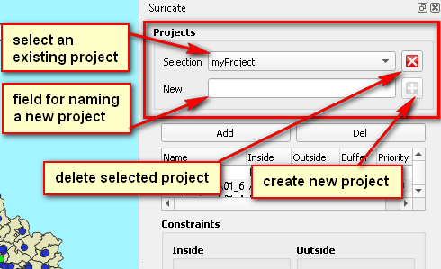
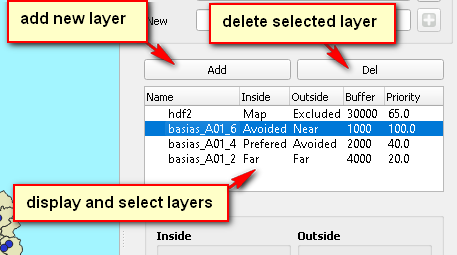
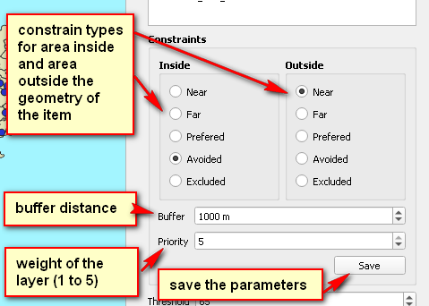
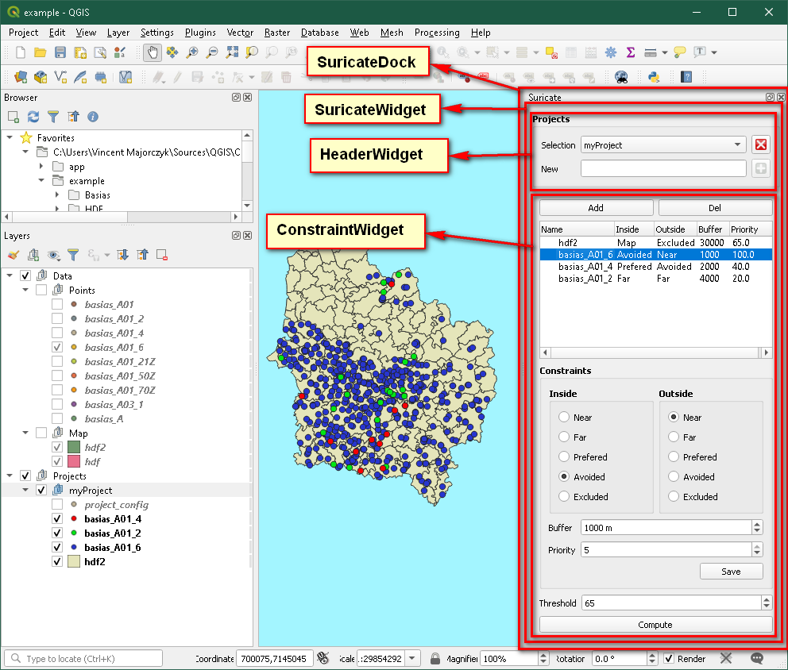

# Suricates plugin for QGIS

## 1) Application

This application is a plugin for the software [QGIS](https://qgis.org/). It is compatible with version *3.40.9* (Long Term Release "Bratislava").

This application is based on the theoretical model and treatment design of [*Eric Masson*](https://pro.univ-lille.fr/eric-masson/), Associate Professor at the *Université de Lille*.

This application was commissioned by the *Université de Lille* (France), *UFR de Géographie et Aménagement*, and funded by ERDF Interreg NWE (SURICATES Project 2017–2023).

This application was initially developed by [Vincent Majorczyk](https://www.linkedin.com/in/vincentmajorczyk/) ([*CDI-Technologies*](https://www.linkedin.com/company/cdi-technologies), 2020).

This application is released under the open source licence [GNU General Public License v3](gpl-3.0.md).

- Repository: https://github.com/CDI-Tech/QGIS-RAIES
- Bug tracking: https://github.com/CDI-Tech/QGIS-RAIES/issues

## 2) Publications

> **Jan 2021**: [Un outil participatif (RAIES) pour la localisation de sites de valorisation de dragage : application à l'estuaire de la Rance.](https://www.researchgate.net/publication/355393946_Un_outil_participatif_RAIES_pour_la_localisation_de_sites_de_valorisation_de_dragage_application_a_l'estuaire_de_la_Rance)
>
> Eric Masson, Edwige Motte, Guillaume G Chevalier, Jean-Baptiste Litot, Christelle Audouit, Philippe Deboudt, Blanpain Olivier

> **Nov 2020**: [RAIE : un outil de cartographie de l'acceptabilité territoriale au réemploi de sédiments d'infrastructure portuaire.](https://www.researchgate.net/publication/346811227_RAIE_un_outil_de_cartographie_de_l'acceptabilite_territoriale_au_reemploi_de_sediments_d'infrastructure_portuaire)
>
> Eric Masson, Edwige Motte, Guillaume G Chevalier, Jean-Baptiste Litot, Christelle Audouit, Philippe Deboudt, Blanpain Olivier
>
> **Conference Paper meriGéo**

> **Oct 2019**: [RAIE : Modélisation des représentations spatiales pour la production de cartes mentales sur base d'ontologie déclarative.](https://www.researchgate.net/publication/337316228_RAIE_Modelisation_des_representations_spatiales_pour_la_production_de_cartes_mentales_sur_base_d'ontologie_declarative)
>
> Eric Masson, Jean-Baptiste Litot, Blanpain Olivier
>
> **Poster**

> **Feb 2019**: [RAIE : Un modèle d'analyse numérique du géopotentiel des territoires basé sur les représentations des contraintes spatiales.](https://www.researchgate.net/publication/330988188_RAIE_Un_modele_d'analyse_numerique_du_geopotentiel_des_territoires_base_sur_les_representations_des_contraintes_spatiales)
>
> Eric Masson, Sarah Cabarry, Jean-Baptiste Litot, Blanpain Olivier
>
> **Presentation, 14th Théo Quant conference**

## 3) Deliverables

- [Deliverable 1-1: Sediment management GIS add-on development and testing](https://github.com/CDI-Tech/QGIS-RAIES/blob/main/deliverables/WP%20T1%20Deliverable%201-1%20Sediment%20management%20GIS%20add-on%20development%20and%20testing_Final.pdf)
- [Deliverable 1-2: Sediment management GIS implementation](https://github.com/CDI-Tech/QGIS-RAIES/blob/main/deliverables/WP%20T1%20Deliverable%201-2%20Sediment%20management%20GIS%20implementation_Final.pdf)
- [Deliverable 1-3: Identification of 3 New Sediment Use Opportunities](https://github.com/CDI-Tech/QGIS-RAIES/blob/main/deliverables/WP%20T1%20Deliverable%201-3%20Identification%20of%203%20New%20Sediment%20Use%20Opportunities_Final.pdf)

## 4) User manual

### 4.1) Install the plugin

Compress the plugin folder into a *ZIP* file. Then go to *Menu / Plugins / Manage and install plugins / Install from ZIP* and load the ZIP file. A new submenu named **RAIES** appears under *Menu / Plugins*, containing an action named **RAIES** that opens a panel on the right side of the QGIS main window.

### 4.2) Prepare data

The application must be used within a *QGIS* project containing prepared data. All input layers must share a common projected CRS (Coordinate Reference System, in metres — not degrees). Only vector layers are accepted as input. These will be used to produce a cumulated constraint raster.

> **Important:** all layers must be in the same projected CRS as the map layer. The application checks CRS consistency at computation time and will abort with a diagnostic report if mismatches are found.

### 4.3) Manage RAIES projects

When the application starts, a group **Projects** is created at the root of the layer panel. All RAIES projects within the current QGIS project appear as subgroups of this group.

A *RAIES* project is a named collection of constraint choices used to generate a raster indicating the best locations according to those constraints.

The RAIES panel is divided into three parts: project management, constraint list management, and individual constraint configuration.

The project management area contains:

- a combobox listing available projects;
- a button to delete the selected project;
- a text field to enter a new project name;
- a button to create a new project (disabled if the name already exists).

Each project appears as a subgroup of the **Projects** group in the layer panel. The subgroup contains a layer named *project_config* which stores constraint information. This is reflected in the constraint list displayed in the RAIES panel.

### 4.4) Configure a project

The second part of the RAIES panel allows adding, removing, and selecting constraints.

The first layer to add is the **map layer**: the polygon defining the overall study area within which computation will be performed. It appears in the list with constraint type *Map* and allows configuration of a buffer around the zone.

A layer is added by selecting it in the layer panel, then clicking **Add**. If no features are selected, the entire layer is copied into the project group. If features are selected (by spatial selection, attribute filter, etc.), only those features are copied.

Subsequent layers are configured with the following parameters:

- a **buffer distance** around the geometry of the input layer's features;
- an **inside constraint type**: applied within the geometry (and its buffer);
- an **outside constraint type**: applied outside the geometry;
- a **priority weight** applied to the output raster relative to other constraints.

Click **Save** to save the current constraint's parameters.

There are five constraint types:

- **Attractive** and **Repulsive**: a distance gradient is computed from the geometry boundary. For *Attractive*, cells near the boundary have value 0 (black) and far cells have value 1 (white). For *Repulsive*, near cells are 1 and far cells are 0.
- **Included**: all cells in the considered zone receive value 0.
- **Excluded**: all cells in the considered zone receive value 1 (the priority weight).
- **Sanctuarized**: all cells in the considered zone are excluded from the final raster (No-Data).

### 4.5) Compute the raster

Saving the QGIS project before computing is strongly recommended to avoid data loss if the application crashes.

To run the computation: set a threshold value and click **Compute**. Progress is shown in the QGIS status bar.

For each constraint layer, the application produces a raster weighted by the priority value. All weighted rasters are then cumulated and normalised to the range [0, 1]. Finally, the cumulated raster is thresholded: cells with a value **below** the threshold are retained (favourable locations), and cells above the threshold are set to No-Data.

The weighted rasters, the cumulated raster, and the thresholded raster are added to the project subgroup. At the end of computation, a dialog asks whether to delete the intermediate temporary rasters from the *tmp/* folder.

### 4.6) Note on layer panel manipulation

Direct manipulation of the layer panel is not the intended way to manage projects and may cause unexpected behaviour. However, several protections are in place:

- Creating a subgroup inside **Projects** is treated as a new project creation (a *project_config* layer is created when the project is first selected).
- Renaming a project to an existing name is prevented.
- Layers not found on disk are flagged in the constraint list.

## 5) Development

### 5.1) General

The project contains the following classes:

- `SuricatesInstance`: manages application state and data access (files, layers, layer tree);
- `SuricatesAlgo`: a `QgsTask` subclass that runs the raster computation; contains all processing algorithms;
- `Debug`: logging and debugging utilities;
- UI classes:
  - `HeaderWidget`: project management (creation, deletion, selection);
  - `ConstraintWidget`: constraint configuration for the selected project;
  - `SuricatesWidget`: container for `HeaderWidget` and `ConstraintWidget`;
  - `SuricatesDock`: dockable panel containing `SuricatesWidget`;

Two data structures are used:

- `ConstraintItem`: holds all parameters for a single constraint (layer path, inside/outside types, buffer, priority);
- `ConstraintType`: enumeration of the five constraint categories.

The function `mainProgram()` is called at startup: it closes any existing instance and creates a new one.

### 5.2) User interface

The UI classes are nested as follows:

- `SuricatesDock` contains `SuricatesWidget`;
- `SuricatesWidget` contains `HeaderWidget` and `ConstraintWidget`.

`HeaderWidget` manages projects; `ConstraintWidget` manages constraints of the selected project. `SuricatesWidget` and `SuricatesDock` are simple containers.

### 5.3) Other classes

`SuricatesInstance` handles three responsibilities:

- application lifecycle (startup, shutdown, signal connections);
- access to files and layers (creation, copy, naming);
- layer tree management (group and layer insertion).

`SuricatesAlgo` is a task that computes a raster from a list of `ConstraintItem` objects. Each item's `name` attribute contains the absolute path to the corresponding vector layer. The class manages all files and layer tree entries created during computation.

### 5.4) Generate documentation

The source code uses [Doxygen](https://www.doxygen.nl/download.html) documentation syntax. To generate the HTML documentation:

1. Install Doxygen;
2. Open the *Doxywizard* application;
3. Load the Doxygen project file: `doc/Doxyfile`;
4. On the *Run* tab, click **Run doxygen**;
5. Click **Show HTML output**, or open `doc/html/index.html` in a browser.

---

> **Copyright notice (readme.md)**
> Author: Vincent Majorczyk (2020-2026).
> Licence: Permission is granted to copy, distribute and/or modify this document under the terms of the [GNU Free Documentation License 1.3](fdl-1.3.md) or any later version published by the Free Software Foundation, with no Invariant Sections, no Front-Cover Texts, and no Back-Cover Texts.